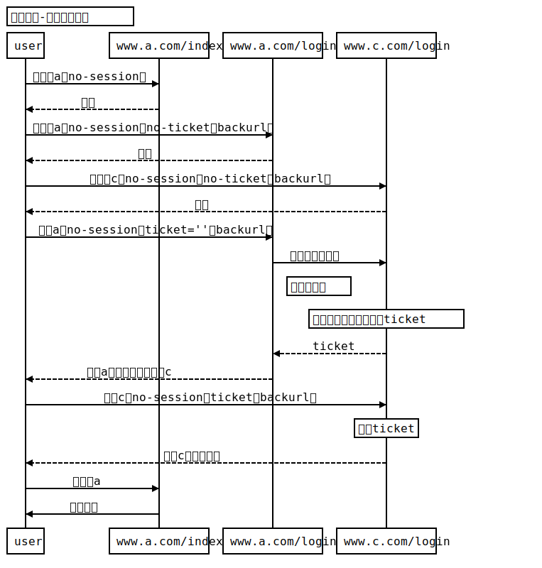
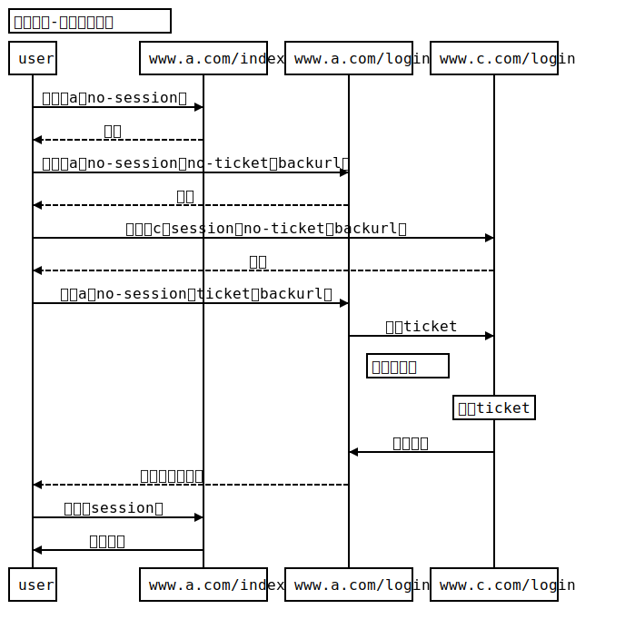

# 单点登录测试 sso-test

单点登录Node.js实现，使用了express框架及pug模板，用nginx作为反向代理服务器。

> node version > 7.0

### Host配置
```
127.0.0.1 www.a.com
127.0.0.1 www.b.com
127.0.0.1 www.c.com
```

### Nginx 配置
```conf
    # www.a.com
    server {
      listen 80;
      server_name www.a.com;

      location / {
        proxy_pass http://127.0.0.1:8080/;
      }
    }

    # www.b.com
    server {
      listen 80;
      server_name www.b.com;

      location / {
        proxy_pass http://127.0.0.1:8081/;
      }
    }

    # www.c.com
    server {
      listen 80;
      server_name www.c.com;

      location / {
        proxy_pass http://127.0.0.1:8082/;
      }
    }
```

### 时序图

（时序图使用了[http://webchart.ihuhai.cn/](http://webchart.ihuhai.cn/) 画的）


